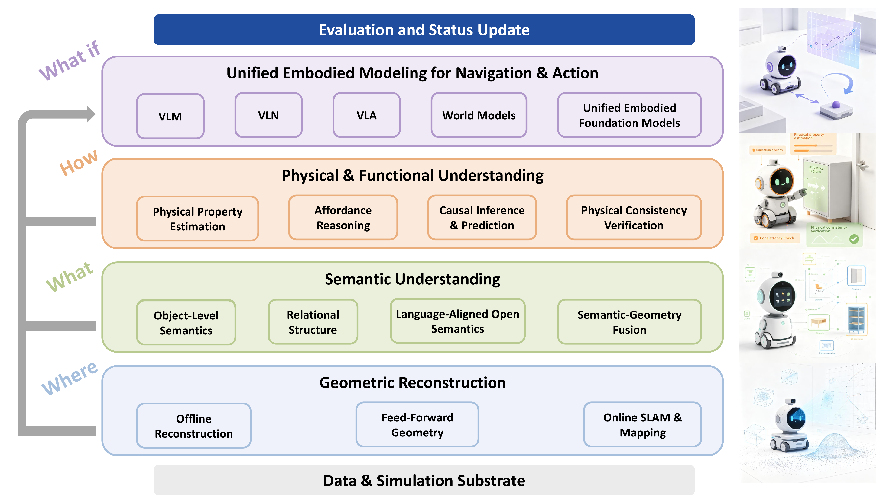

# 🤖 From Geometric Reconstruction to Actionable Scene Understanding for Embodied Manipulation: A Survey

<div align="center">

[**Yaze Li**](https://saltgardenia.github.io/) <sup>†</sup> · [**Xinyu Xie**](mailto:2024218501@mail.hfut.edu.cn) <sup>†</sup> · [**Jiawei Ma**](mailto:2024218545@mail.hfut.edu.cn) <sup>†</sup> · [**Siying Song**](mailto:2024218492@mail.hfut.edu.cn) <sup>†</sup> · [**Jianan Zou**](mailto:jiananzou@example.com) · [**Haihong Xiao**](mailto:haihong@mail.hfut.edu.cn) <sup>∗</sup> · [**Wei Jia**](mailto:weijia@mail.hfut.edu.cn)

*School of Computer Science and Information Engineering, Hefei University of Technology, Hefei, China*

[](https://github.com/SaltGardenia/Actionable-Scene-Understanding/raw/main/public/main.pdf)&nbsp;
[](https://arxiv.org/abs/0000.00000)&nbsp;
[](https://github.com/SaltGardenia/Actionable-Scene-Understanding)&nbsp;
[](https://saltgardenia.github.io/Actionable-Scene-Understanding/)&nbsp;

🎉 Welcome to the official project page repository of our survey paper.

</div>

---

## 📌 Abstract

Recent advances in 3D vision and embodied intelligence are driving a transition in indoor scene understanding from geometric reconstruction toward representations that support reasoning and physical interaction. While existing methods can recover scene geometry and semantic information, embodied agents require a deeper understanding of functional and physical properties, as well as the ability to predict the consequences of actions. This survey reviews the evolution of indoor scene understanding from 3D reconstruction to actionable scene understanding for embodied manipulation, encompassing geometric reconstruction, semantic understanding, functional and physical understanding, and their integration into embodied intelligence. We examine how scene representations have evolved from describing visible structures to supporting semantic interpretation, functional and physical reasoning, prediction, and action. Beyond summarizing existing methods, we identify four emerging directions: inferring invisible environmental states from visual observations, learning through physical self-supervision, modeling latent human states, and extending embodied intelligence from task completion toward human empowerment. These directions highlight the need for physically grounded and human-centered scene representations that better support embodied reasoning, prediction, and action.

**Keywords:** *Indoor Scene Reconstruction, Spatial Intelligence, World Models, Embodied Navigation*

<p align="center">
  
</p>

<p align="center">
  <b>Figure 1.</b> Unified hierarchical framework of actionable scene understanding for embodied indoor manipulation.
</p>

---

## ✨ Introduction

Indoor scene understanding connects visual sensing to spatially grounded behavior in computer vision, robotics, and embodied intelligence. Early RGB-D systems established the geometric and localization foundations for indoor reconstruction, while image-based structure-from-motion provided a complementary route to camera and geometry estimation. Datasets such as NYU Depth V2, ScanNet, and Matterport3D added dense semantic labels and object-level structure. Neural radiance fields, 3D Gaussian splatting, feed-forward geometric transformers, and multimodal 3D models have since expanded the representational space from explicit geometry to continuous, view-dependent, and language-aligned scene descriptions. The central question is therefore no longer only how to reconstruct a scene, but how to represent it in a form that supports reliable downstream behavior.

For manipulation, visual recognition alone is insufficient. An agent must determine not only where an object is and what category it belongs to, but also which parts are functional, where contact is feasible, how articulation constrains motion, and how the scene may change after an action. Affordance detection methods and action-conditioned or functional scene datasets make these requirements explicit; functional 3D scene graphs further encode relations that can support interaction and planning. Thus, a scene can be geometrically accurate or semantically complete yet remain unusable for manipulation: *perceptual correctness does not necessarily imply actionability*.

This observation motivates an expanded scene representation. Conventional representations primarily encode geometry and semantics — where entities are and what they are — whereas embodied manipulation also requires affordances, physical constraints, and action-conditioned state changes. We summarize this requirement as

> `{G, S}`  — *Geometry and Semantics*  ⟶  `{G, S, F, P, C}`  — *Actionable Scene Representation*

where `G` denotes geometric structure, `S` denotes semantic information, `F` denotes functional and affordance-related properties, `P` denotes physical properties and constraints, and `C` denotes information relevant to action consequences. This transition reflects a shift from describing what is present in a scene to representing what can be understood, predicted, and acted upon.

The corresponding capability chain is

> **3D Reconstruction** → **Semantic Understanding** → **Physical Understanding** → **Prediction** → **Action**

The arrows denote increasing information and reasoning requirements rather than a strict temporal sequence: geometry supports semantic interpretation, semantics and relations support functional reasoning, physical knowledge constrains feasible interaction, and predictive models connect scene states to possible outcomes. This view is consistent with work on physical prediction and world models, as well as with embodied navigation platforms and manipulation policies that map multimodal observations to executable behavior. *Actionable scene understanding* is consequently an integration objective: the representation must be useful for reasoning about, predicting, and selecting actions, not merely for describing the current observation.

The literature addressing these requirements is still distributed across partially disconnected communities. Reconstruction benchmarks emphasize geometry and appearance, semantic and language-grounding methods emphasize recognition and relations, affordance and physical-reasoning studies emphasize interaction properties, and embodied benchmarks evaluate navigation or manipulation outcomes. These works provide complementary pieces, but their supervision and metrics are usually separated; consequently, gains in one capability do not automatically establish physically valid or executable behavior. A unified account of the transition from descriptive 3D reconstruction to actionable scene understanding is therefore needed, especially for manipulation, where geometry, function, physical constraints, and action consequences must be jointly available.

To address this gap, this survey reviews the evolution of indoor scene understanding from *3D reconstruction to actionable scene understanding for embodied manipulation*. Rather than organizing the literature solely according to model architectures or individual application scenarios, we organize it according to the increasing capabilities required from scene representations. We first review geometric reconstruction as the foundation of spatial representation, followed by semantic understanding of objects, attributes, and relations. We then examine functional and physical understanding, including affordances, articulation, physical properties, and interaction constraints, before discussing the integration of scene understanding with embodied intelligence, multimodal reasoning, prediction, and action. In addition to systematically reviewing representative methods, datasets, and evaluation protocols, we analyze the limitations that emerge at each stage and the gaps between perceptual performance and embodied utility. Finally, we identify four emerging directions: *inferring invisible environmental states from visual observations, learning through physical self-supervision, modeling latent human states, and extending embodied intelligence from task completion toward human empowerment*. Together, these directions highlight the need for scene representations that are not only geometrically and semantically informative, but also *physically grounded, functionally meaningful, and useful for embodied reasoning, prediction, and action*.

---

## 🔖 Citation

If you find this survey useful, please consider citing:

```bibtex
@article{li2026actionable,
  title={From Geometric Reconstruction to Actionable Scene Understanding for Embodied Manipulation: A Survey},
  author={Li, Yaze and Xie, Xinyu and Ma, Jiawei and Song, Siying and Xiao, Haihong},
  journal={arXiv preprint},
  year={2026}
}
```
